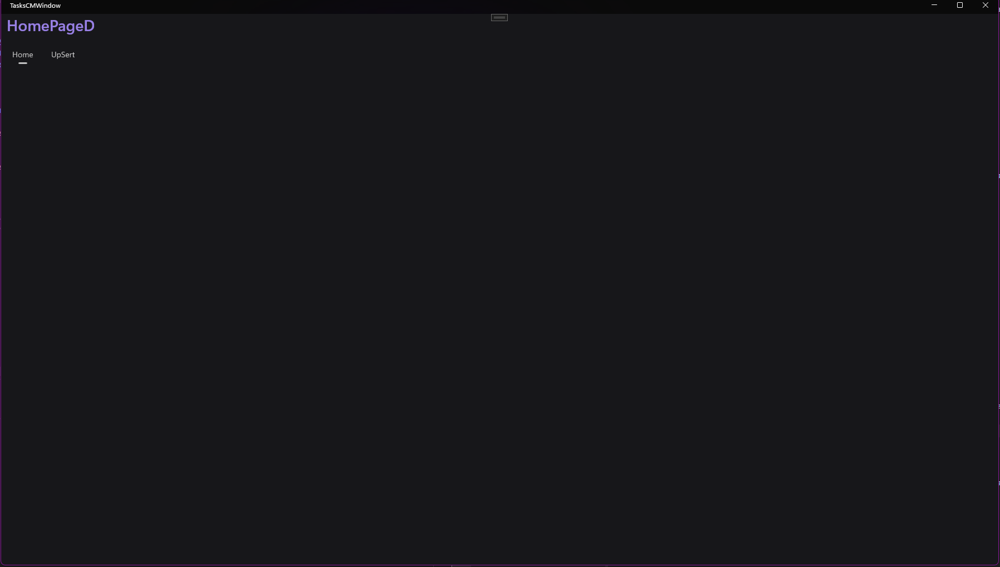

## Pages Creations and environment Setup:
### First We Create Pages and with reasons.

| Page Created                       | Reason                                                                                      |
|------------------------------------|---------------------------------------------------------------------------------------------|
| HomePageD/M<br>UpSertSingleTaskD/M | To Add in the respective UIs                                                                |
| TasksCMWindow                      | To use the newly added Window view in .NET MAUI ([More Here](https://youtu.be/xSrzXRZvBQA)) |


### Then we create files as well
| File            | Reason                                                                                                                                                             |
|-----------------|--------------------------------------------------------------------------------------------------------------------------------------------------------------------|
| GlobalUsings.cs | To Store all Global Usings [More here](https://blog.jetbrains.com/dotnet/2021/11/18/global-usings-in-csharp-10/)<br><br>Essentially making referencing much faster |
| ViewModel.cs    | To Store the Main Logic of the App as we are going to use the MVVM approach                                                                                        |
### And finally, do a bunch of edits to setup!
## 1. Add Global Usings
```csharp
global using Fonts;

global using TasksCM.Services;
global using TasksCM.Utilities;
global using CommunityToolkit.Mvvm.ComponentModel;

global using CommunityToolkit.Maui;
global using Microsoft.Extensions.Logging;
global using Syncfusion.Maui.Toolkit.Hosting;


global using TasksCM.Pages.Desktop;
global using TasksCM.Pages.Mobile;
global using TasksCM.Pages;
global using TasksCM.Models;
```

## 2. Register Pages in `MauiProgram.cs`

Register Pages as Singleton both desktop and mobile side.

```csharp
namespace TasksCM;

public static class MauiProgram
{
    public static MauiApp CreateMauiApp()
    {
        var builder = MauiApp.CreateBuilder();
        builder
            .UseMauiApp<App>()
            .UseMauiCommunityToolkit()
            .ConfigureSyncfusionToolkit()
            .ConfigureMauiHandlers(handlers =>
            {
            })
            .ConfigureFonts(fonts =>
            {
                fonts.AddFont("OpenSans-Regular.ttf", "OpenSansRegular");
                fonts.AddFont("OpenSans-Semibold.ttf", "OpenSansSemibold");
                fonts.AddFont("SegoeUI-Semibold.ttf", "SegoeSemibold");
                fonts.AddFont("FluentSystemIcons-Regular.ttf", FluentUI.FontFamily);
            });

#if DEBUG
		builder.Logging.AddDebug();
		builder.Services.AddLogging(configure => configure.AddDebug());
#endif


        //Register Desktop pages here as singleton services
        builder.Services.AddSingleton<HomePageD>();
        builder.Services.AddSingleton<UpSertSingleTaskD>();        
        builder.Services.AddSingleton<TasksCMWindow>();

        //Register mobile pages here as singleton services
        builder.Services.AddSingleton<HomePageM>();
        builder.Services.AddSingleton<UpSertSingleTaskM>();
        return builder.Build();
    }
}
```
## 3. Update App.xaml.cs
To override/ensure TasksCMWindow (the custom window we want) is now our app's "Main Container"

```csharp
namespace TasksCM;

public partial class App : Application
{
    public App(TasksCMWindow tasksCMWindow)
    {
        InitializeComponent();
        TasksCMWindow = tasksCMWindow;
    }

    public TasksCMWindow TasksCMWindow { get; }

    protected override Window CreateWindow(IActivationState? activationState)
    {
        TasksCMWindow.Page = new AppShell();
        return TasksCMWindow;
        //return new Window(new AppShell()); this is the default maui implementation
    }
}
```
## 4. Update AppShell.xaml.cs
To ensure the App Shell (I like to see Shell as [the Conductor](https://www.google.com/search?sca_esv=5ba226dad54597e9&sxsrf=ADLYWIIBHG-OtTJToMAibIboshveQjBrVw:1736155725343&q=orchestra+conductor&udm=2&fbs=AEQNm0Aa4sjWe7Rqy32pFwRj0UkWd8nbOJfsBGGB5IQQO6L3JyJJclJuzBPl12qJyPx7ESJaJcVcqks9dRTixhoWOXFxQnM33MKY5hpykAVicd2_zxui8V4NtqOMz9zVV3hJ199CAL3fb7Kkzp2ozE3Sy3BWl9qeAbyL1D25IjTJApzonrMq0er0aPw13VcohjO_iXBOpYDRh_22pLLHJL0Oy2CkXWbn9w&sa=X&ved=2ahUKEwj2naKK5OCKAxWIjYkEHQ51CmcQtKgLegQIFxAB&biw=3440&bih=1277&dpr=1#vhid=Euc9Od5xAoryJM&vssid=mosaic) of the App that tells when/how to navigate - very beautiful when you get a hang of!)

- Registering Route is a way of telling .NET MAUI : If I need to go to this page, this is **how** you can know it exists.

```csharp
namespace TasksCM;

public partial class AppShell : Shell
{
    public AppShell()
    {
        InitializeComponent();

        Routing.RegisterRoute(nameof(HomePageD), typeof(HomePageD));
        Routing.RegisterRoute(nameof(UpSertSingleTaskD), typeof(UpSertSingleTaskD));
    }
}
```

## 5. Lastly, Updating AppShell.xaml itself!
```csharp
<?xml version="1.0" encoding="UTF-8" ?>
<Shell
    x:Class="TasksCM.AppShell"
    xmlns="http://schemas.microsoft.com/dotnet/2021/maui"
    xmlns:x="http://schemas.microsoft.com/winfx/2009/xaml"
    xmlns:viewsD="clr-namespace:TasksCM.Pages.Desktop"
    Shell.FlyoutBehavior="Disabled"
    >

    <FlyoutItem FlyoutDisplayOptions="AsSingleItem" x:Name="shellTabbar">
        
        <!--This ensures there will be a button to open "Home" page found under Pages/Desktop/-->
        <Tab Title="Home" x:Name="homeTab">
            <ShellContent ContentTemplate="{DataTemplate viewsD:HomePageD}"/>
        </Tab>
        
        <!--This ensures there will be a button to open "UpSertSingleTaskD" page  found under Pages/Desktop/-->
        <Tab Title="UpSert" x:Name="upsertTab">
            <ShellContent ContentTemplate="{DataTemplate viewsD:UpSertSingleTaskD}"/>
        </Tab> 
    </FlyoutItem> 

</Shell>
```

# Expected solution layout


# Result



